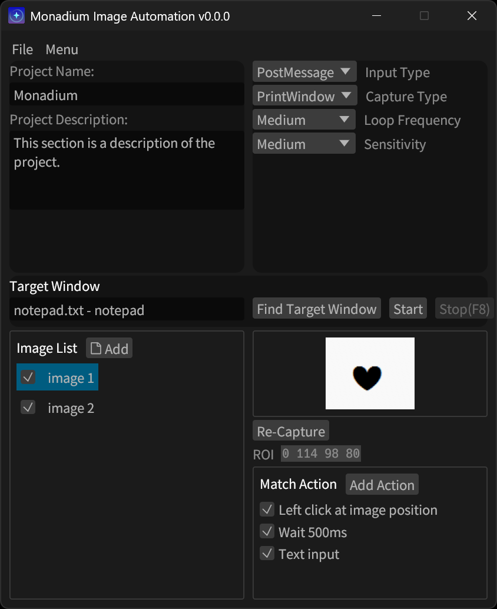

# mona-auto: 


**mona-auto** is a powerful automation tool for Windows that recognizes on-screen images and performs predefined actions — no scripting required.  
Just register the image you want to detect and assign actions like clicks, keystrokes, or text input.

---

<a href="https://discord.gg/JZhRmnZVxB"></a>

<div align="center">
  <h3>
    <span> | </span>
    <a href="https://github.com/yi-jehyung/mona-auto/blob/main/translations/ko-kr/README.md"> 한국어 </a>
  </h3>
</div>

## Features

- **Image-based automation** using template matching
- Mouse click, drag, scroll, and keyboard actions
- Text input support
- Internationalization (i18n) ready
- Send Discord (send message/screenshot)
- GUI built with [`egui`](https://github.com/emilk/egui)

---

## Installation

### Download (Recommended)

You can download the latest prebuilt version from the [Releases](https://github.com/yi-jehyung/mona-auto/releases) page:

1. Go to [Releases](https://github.com/yi-jehyung/mona-auto/releases)
2. Download `mona-auto.zip` for Windows
3. Extract the ZIP file
4. Run `mona-auto.exe`

---

### Build from Source (for developers)

If you'd like to build it yourself:

Install [Rust](https://www.rust-lang.org/tools/install) and Cargo

```bash
git clone https://github.com/yi-jehyung/mona-auto
cd mona-auto
cargo build --release
```

The compiled binary will be in: `target/release/mona-auto.exe`

---

## Usage
1. Launch `mona-auto.exe`.
2. Select the target window.
3. Add image.
4. Capture a screen region.
5. Add one or more actions (click, type, delay, etc.).
6. Click "Start" — mona-auto will act when a match is found!

---

## Screenshots

| UI | Action Configuration | Screenshot |
|----|----------------------|------------|
|  |  |  |

---

## Roadmap
- [x] Basic image matching and automation
- [ ] OCR support
- [ ] Script support
- [ ] Variable support

---

## Contributing
We welcome contributions of all kinds!
Bug reports, feature suggestions, UI improvements, or translation edits — they're all valuable!

Feel free to [open an issue](https://github.com/yi-jehyung/mona-auto/issues) or submit a pull request.

Join our **Discord community** to ask questions or share feedback
<a href="https://discord.gg/JZhRmnZVxB"></a>

---

> ⚠ **Note**  
> This application is currently under active development and may be unstable.  
> It is designed for **Windows only**, and has not been tested on other platforms.  
> Use at your own risk — the developer is **not responsible for any damage or issues** caused by its usage.

---

## Logo & Branding

The **mona-auto** logo is a trademark of **Jehyung Yi**.  
It is protected by copyright and may not be used without explicit permission.  
All rights reserved © 2025.
